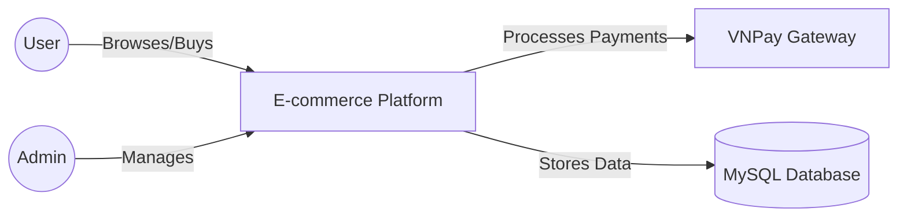
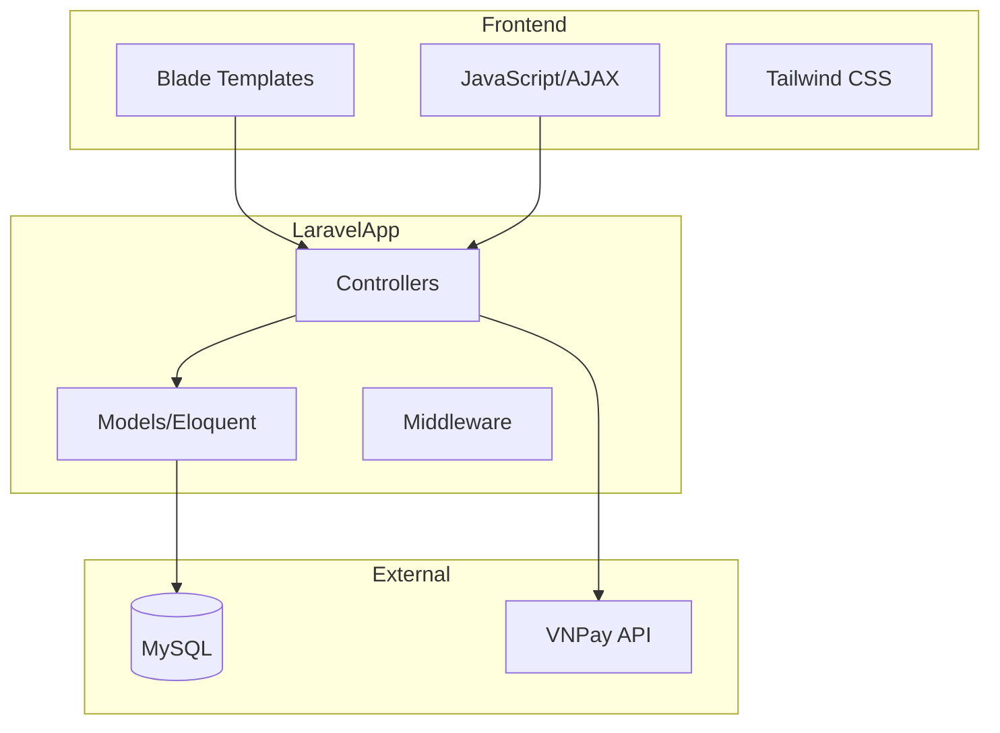
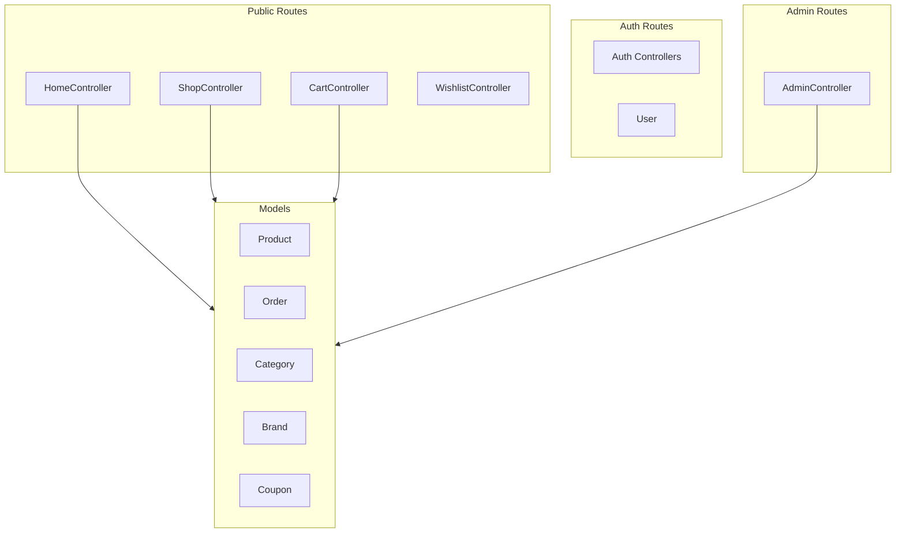

# Architecture Overview

## System Context (C4 Level 1)

## Container Architecture (C4 Level 2)

## Component Architecture (C4 Level 3)

## Route Architecture

### Public Routes
- `/` - Home page
- `/shop` - Product listing
- `/product/{slug}` - Product details
- `/cart` - Shopping cart
- `/wishlist` - Wishlist
- `/checkout` - Checkout page

### Authenticated User Routes
- `/account-dashboard` - User dashboard
- `/account-orders` - Order history
- `/account-address` - Address management

### Admin Routes (auth + admin middleware)
- `/admin` - Dashboard
- `/admin/products` - Product management
- `/admin/orders` - Order management
- `/admin/brands` - Brand management
- `/admin/categories` - Category management
- `/admin/coupons` - Coupon management

## Module Breakdown

### ShopController
- **Purpose**: Product browsing and details
- **Key Methods**: `index()`, `product_details()`
- **Dependencies**: Product, Category, Brand models

### CartController
- **Purpose**: Shopping cart operations
- **Key Methods**: `add_to_cart()`, `checkout()`, `place_an_order()`
- **Dependencies**: ShoppingCart package, Coupon model

### AdminController
- **Purpose**: Admin dashboard and CRUD operations
- **Key Methods**: Brands, categories, products, orders, coupons management
- **Dependencies**: All models, Image intervention

### UserController
- **Purpose**: User account management
- **Key Methods**: Address management, order history, profile updates
- **Dependencies**: User, Address, Order models

## Key Design Decisions

1. **Shopping Cart Package**: Using surfsidemedia/shoppingcart
   - Rationale: Pre-built cart functionality saves development time
   - Trade-off: Less flexibility than custom implementation

2. **VNPay Integration**: Direct controller handling
   - Rationale: Simple integration for Vietnam market
   - Trade-off: Payment logic mixed in controller

3. **Role-Based Access**: Middleware-based auth + admin check
   - Rationale: Simple and effective for single-admin model
   - Trade-off: Limited granularity for multi-admin roles