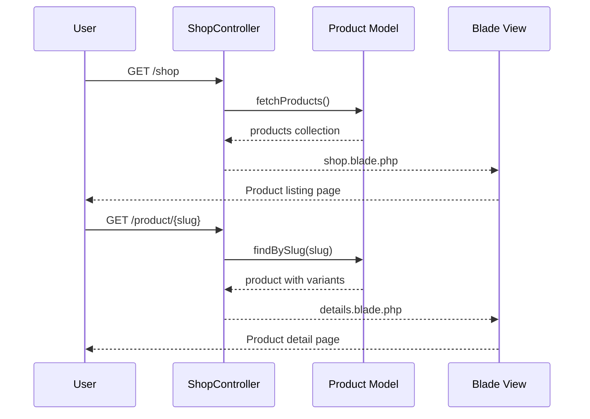
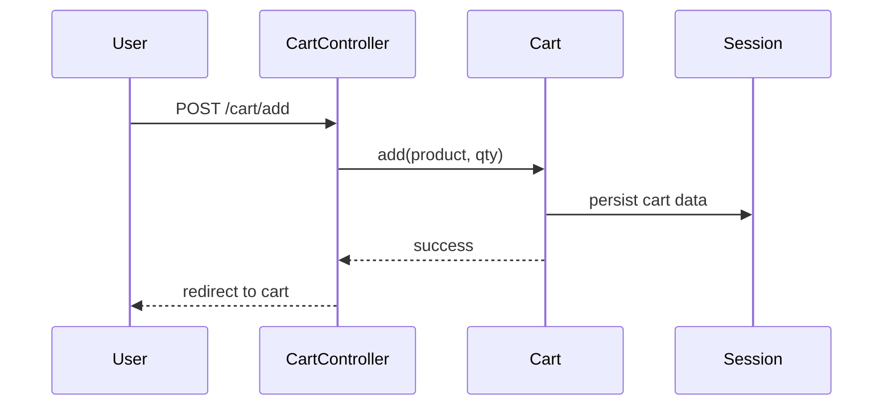
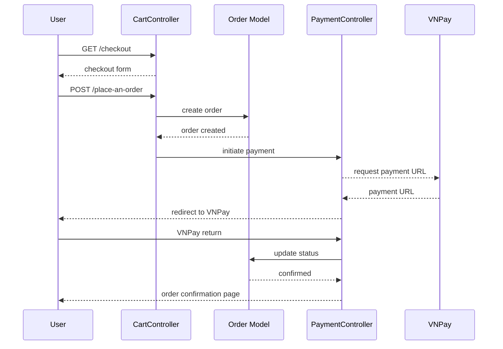
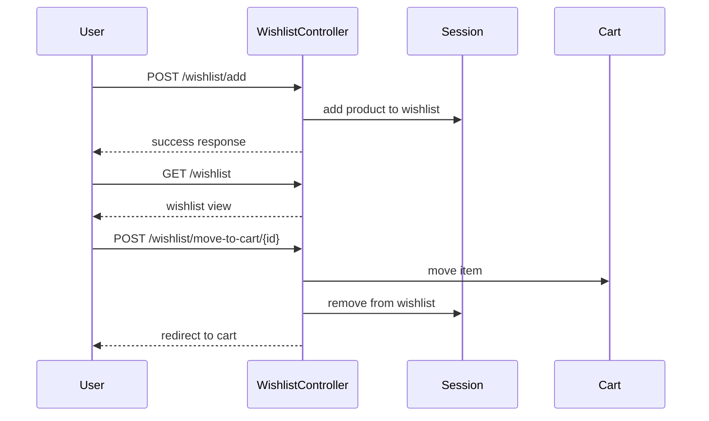
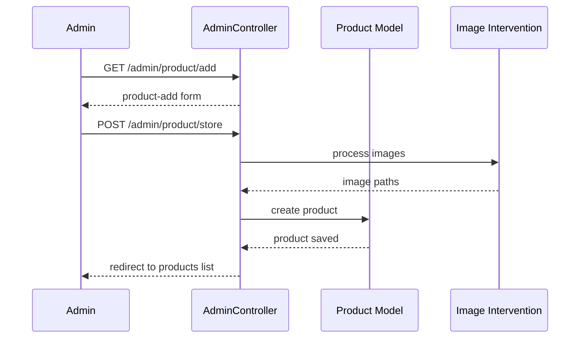
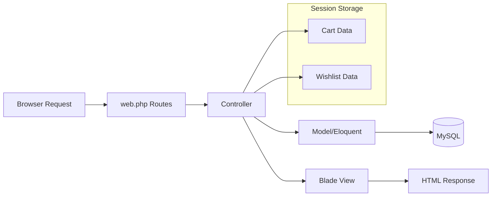

# Workflow Overview

## Core Workflows

### 1. Product Browsing Flow

### 2. Add to Cart Flow

### 3. Checkout & Order Flow

### 4. Wishlist Flow

### 5. Admin Product Management Flow

## Data Flow

## Error Handling

- **Form Validation**: Laravel validation with error messages displayed in views
- **404 Handling**: Laravel automatic 404 for missing models
- **Payment Failures**: Redirect back to checkout with error message
- **Image Upload Failures**: Catch exceptions, display status message

## State Management

- **Cart State**: Stored in session via ShoppingCart package
- **Wishlist State**: Stored in session
- **User Authentication**: Laravel's built-in auth with session
- **Flash Messages**: Session-based status messages for redirects