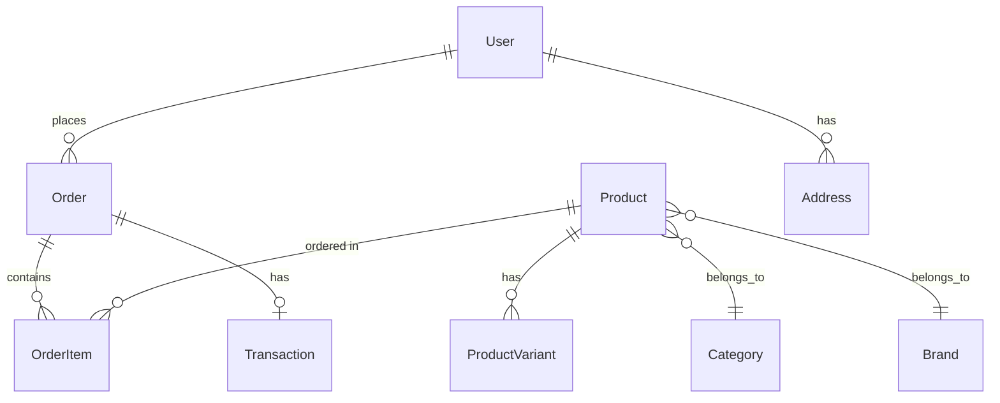

# Deep Dive: Data Models

## Overview

The application uses Eloquent ORM for database operations with models for Products, Orders, Users, Categories, Brands, and more.

## Model Relationships



## Model Details

### Product

```php
class Product extends Model
{
    public function category()
    {
        return $this->belongsTo(Category::class, 'category_id');
    }

    public function brand()
    {
        return $this->belongsTo(Brand::class, 'brand_id');
    }

    public function variants()
    {
        return $this->hasMany(ProductVariant::class);
    }
}
```

**Key Attributes**: id, name, slug, description, price, quantity, category_id, brand_id, status

### Order

```php
class Order extends Model
{
    public function user()
    {
        return $this->belongsTo(User::class);
    }

    public function orderItems()
    {
        return $this->hasMany(OrderItem::class);
    }

    public function transaction()
    {
        return $this->hasOne(Transaction::class);
    }
}
```

**Key Attributes**: id, user_id, subtotal, total, status, name, email, phone, address

### OrderItem

Represents individual items within an order with product reference, quantity, and price.

### ProductVariant

Represents product variations (size, color) with their own pricing and stock.

### Transaction

Stores VNPay payment transaction details including vnpay transaction info.

## Database Schema

### Tables

| Table | Purpose |
|-------|---------|
| `users` | User accounts |
| `addresses` | User addresses |
| `brands` | Product brands |
| `categories` | Product categories |
| `products` | Product catalog |
| `product_variants` | Product variations |
| `orders` | Customer orders |
| `order_items` | Order line items |
| `transactions` | Payment transactions |
| `coupons` | Discount coupons |
| `slides` | Homepage carousel |
| `contacts` | Contact form messages |