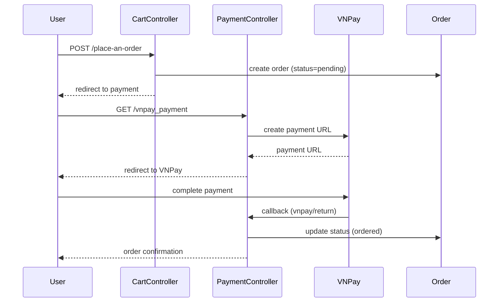

# Deep Dive: Payment Integration

## Overview

The application integrates with VNPay payment gateway for order processing. The `PaymentController` handles all payment-related operations.

## PaymentController

**File**: `app/Http/Controllers/PaymentController.php`

### Key Methods

| Method | Route | Purpose |
|--------|-------|---------|
| `vnpay_payment()` | GET /vnpay_payment | Initiate VNPay payment |
| `vnpayReturn()` | GET /vnpay/return | Handle VNPay callback |

## Payment Flow



## VNPay Integration Details

### Payment Request

```php
public function vnpay_payment(Request $request)
{
    // Build VNPay URL with parameters:
    // - vnp_Amount: amount in VND (x100)
    // - vnp_Command: pay
    // - vnp_CurrCode: VND
    // - vnp_Locale: vn
    // - vnp_OrderInfo: order description
    // - vnp_ReturnUrl: callback URL
    // - vnp_TxnRef: unique transaction reference
}
```

### Return Handling

```php
public function vnpayReturn(Request $request)
{
    // Verify signature
    // Update order status based on vnp_ResponseCode
    // Redirect to confirmation page
}
```

## Order Status Flow

| Status | Description |
|--------|-------------|
| `pending` | Order created, awaiting payment |
| `ordered` | Payment confirmed |
| `delivered` | Order shipped |
| `canceled` | Order cancelled |

## Dependencies

- **Internal**: Order, Transaction models
- **External**: VNPay API