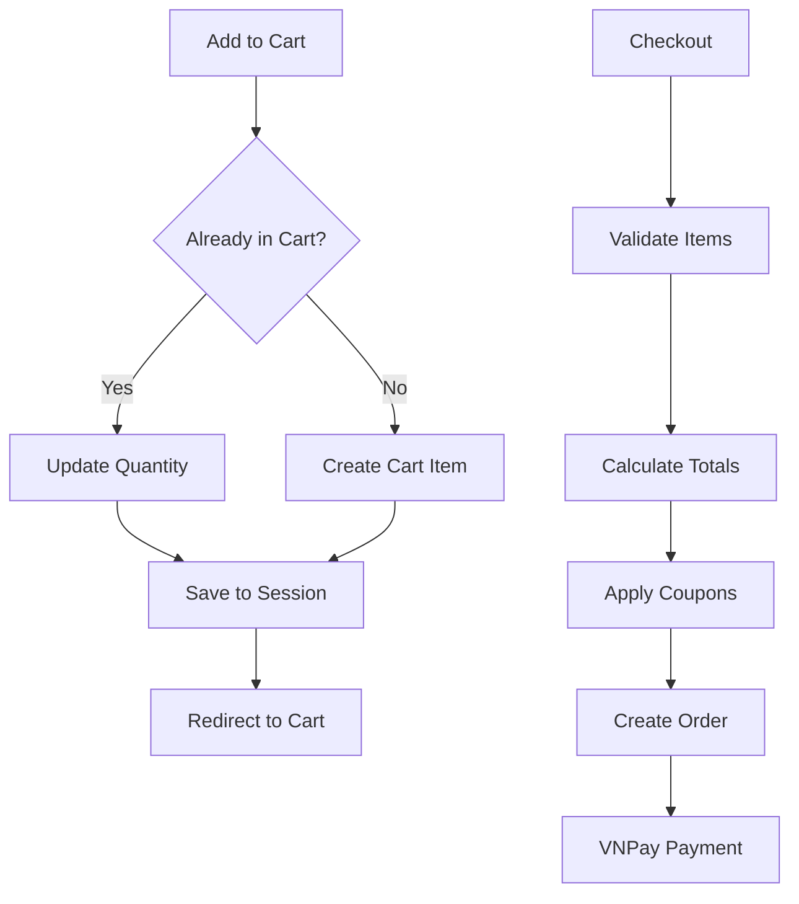
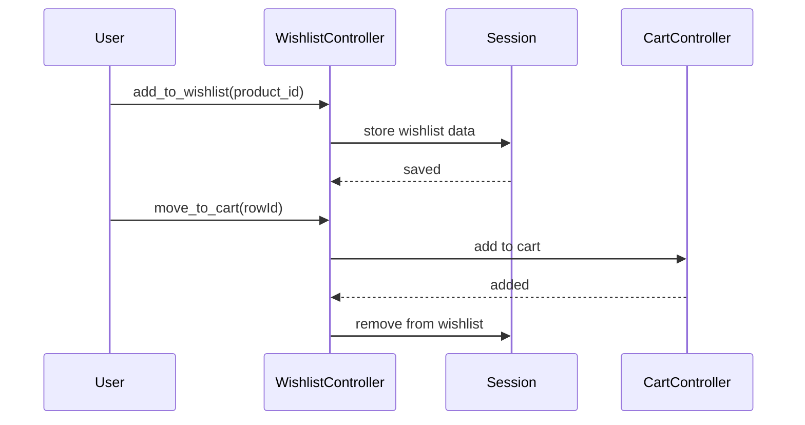

# Deep Dive: Shopping Cart & Wishlist

## Overview

The application uses the `surfsidemedia/shoppingcart` package for cart functionality and session-based storage for wishlist management.

## Shopping Cart Architecture

### CartController

Handles all cart operations including add, update, remove, coupon application.

**Key Methods:**

| Method | Route | Purpose |
|--------|-------|---------|
| `index()` | GET /cart | Display cart contents |
| `add_to_cart()` | POST /cart/add | Add item to cart |
| `increase_cart_quantity()` | PUT /cart/increase-quantity/{rowId} | Increase quantity |
| `decrease_cart_quantity()` | PUT /cart/decrease-quantity/{rowId} | Decrease quantity |
| `remove_item()` | DELETE /cart/remove/{rowId} | Remove single item |
| `empty_cart()` | DELETE /cart/clear | Clear entire cart |
| `apply_coupon_code()` | POST /cart/apply-coupon | Apply coupon |
| `remove_coupon_code()` | DELETE /cart/remove-coupon | Remove coupon |
| `checkout()` | GET /checkout | Checkout page |
| `place_an_order()` | POST /place-an-order | Create order |

### Cart Workflow



### Coupon System

Coupons are applied before order placement:

```php
public function apply_coupon_code(Request $request)
{
    $coupon = Coupon::where('code', $request->code)->first();
    if ($coupon) {
        // Apply discount logic
    }
}
```

## Wishlist Architecture

### WishlistController

Session-based wishlist storage for authenticated users.

**Key Methods:**

| Method | Route | Purpose |
|--------|-------|---------|
| `add_to_wishlist()` | POST /wishlist/add | Add product |
| `index()` | GET /wishlist | View wishlist |
| `remove_item()` | DELETE /wishlist/item/remove/{rowId} | Remove item |
| `empty_wishlist()` | DELETE /wishlist/clear | Clear all |
| `move_to_cart()` | POST /wishlist/move-to-cart/{rowId} | Move to cart |

### Wishlist Data Flow



## Dependencies

- **Internal**: Coupon model
- **External**: surfsidemedia/shoppingcart package
- **Storage**: Laravel Session